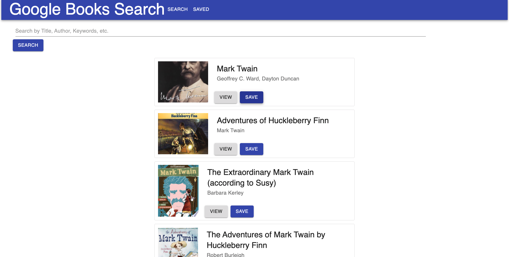
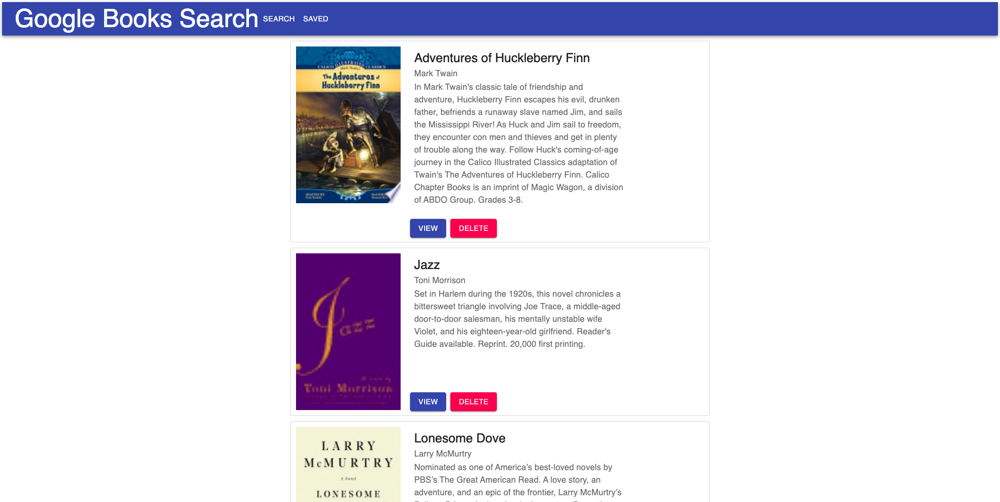

# React Google Books Search


[](https://opensource.org/licenses/MIT)


## [Start searching for your next read!]()


## Description

A user-friendly Google Books app for finding books. The user can search for a title, author, or keyword of a book they would like to read and either save to their read later list or follow the view link to purchase.

This app is a MERN stack application. it utilizes MongoDB, Express, React and Node.js to create a dynamic web application.

The app uses the Google Books API to generate book data based off search terms.

You can test this app at the link above, or follow the instructions in installation/usage to run on your local machine. 








## Table of Contents

- [Installation](#installation)
- [Usage](#usage)
- [Technoloy](#technology)
- [Contributing](#contributing)
- [License](#license)
- [Tests](#test)
- [Questions](#questions)


## Installation

 First, to run on your local machine, please clone the repo and navigate inside of it

 Then, the user must install all the dependencies listed within the package.json. To do so, run:

 ```
 npm i
 ```

 from within the main directory of the app.

 This command will install dependencies in both the main package.json and the client package.json

 The app is now ready for use, start searching!


## Usage

Run the following on the command line to launch the app:

```
npm start
```

From here, the app will launch in your default web browser.  

Or, navigate to [http://localhost:3001](http://localhost:3001/) in your browser to use the app.

The homepage will have a fearch form, start searching for a book to read!

To Navigate to your saved books, click the saved button in the header.


## Technology

This App utilizes the following technologies:

  - ReactJs
  - Node.js
  - MongoDB
  - Mongoose
  - Express.js
  - Material-ui
  - Cors
  - React Router
  - Axios
  

## Contributing

If you would like to contribute to the repository, please contact me at one of the links at the bottom of the README.


## License

[](https://opensource.org/licenses/MIT)


## Tests

  There are not any tests written for this repository.


## Questions

  If you have any questions regarding the repo, please contact me at one of the following:
    
  [Github](https://github.com/Alexva397)

  [LinkedIn](https://www.linkedin.com/in/alexander-vadeboncoeur-287039aa/)

  [asvadeboncoeur@gmail.com](mailto:asvadeboncoeur@gmail.com)


